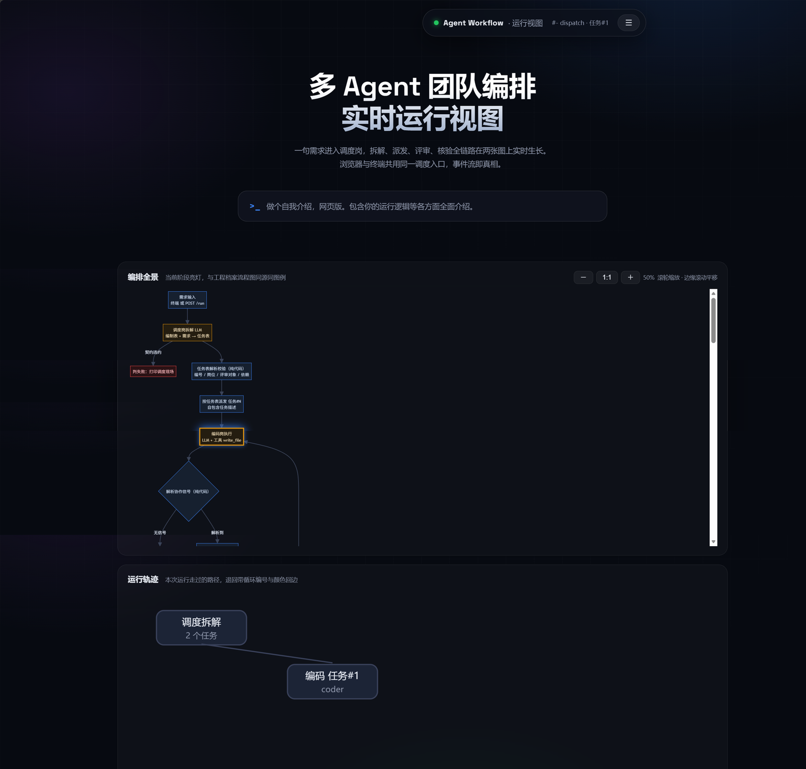
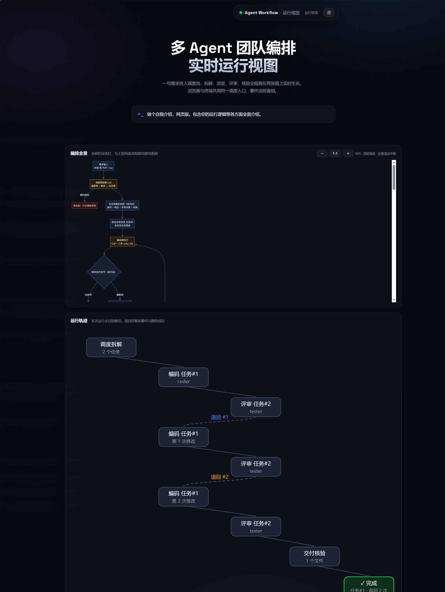
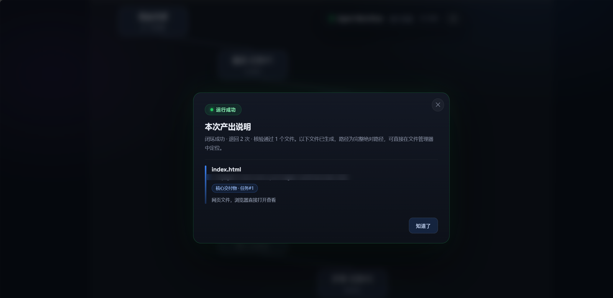
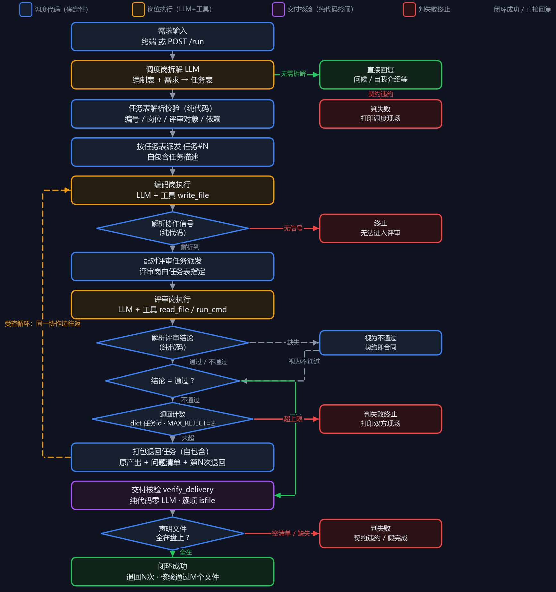

# agent-workflow — 多 Agent 团队编排系统

> **作者**：[LiMuBai-QiuWuJi](https://github.com/LiMuBai-QiuWuJi) ｜ **仓库**：[github.com/LiMuBai-QiuWuJi/agent-workflow](https://github.com/LiMuBai-QiuWuJi/agent-workflow)

一个演示「多个 LLM 智能体如何像团队一样协作交付需求」的编排系统：

**调度智能体**拆解需求、产出任务表 → **编码智能体**实现并声明交付物 → **测试智能体**实际运行代码、出具评审结论 → 不通过则**退回修改、再验收**，循环上限由代码兜底 → 评审通过后，**纯代码的交付核验**确认声明的文件真实存在，才算完成。

系统提供终端与 Web（FastAPI + SSE 事件流、双流程图可视化）两种入口，同一调度内核；支持 Docker 一条命令起服务。

> **定位说明**：这是一个多 Agent 协作机制的**架构验证原型**——重点在机制设计（上下文经济、受控循环、防假完成）与可复现的实测数据，而不是功能堆叠。修改型需求的多轮迭代（交互式产品化）在路线图中，见文末。
>
> **完全新手？** 跟着 [小白上手指南](docs/用户手册.md) 一步步点，从零到跑通约 20 分钟。

---

## 核心机制

### 1. 星型调度，而非链式扩散

调度权在**代码**而非模型自由发挥：转派信号（`[请求协作:岗位key]`）由代码解析，命中率 100%，不受模型输出格式漂移影响。任何协作都必须经调度中心派发，杜绝智能体之间自发形成的不可控调用链。

### 2. 岗位独立记忆与上下文经济

每个岗位的记忆按 `(工程, 岗位)` 双键隔离，互相不可见；工具调用的中间消息执行完即沉淀丢弃，只保留结论进历史；历史按滑动窗口裁剪。

同批任务（3 个需求 × 双岗位、同模型同工具，唯一变量为记忆架构）的实测对比：

| 记忆架构 | prompt tokens | 相对倍数 |
|---|---|---|
| 全员共享一份会话（全量重发、工具消息全累积） | 433,744 | 22.12× |
| 岗位独立记忆 + 工具消息沉淀 + 滑动窗口 | **19,611** | **1×（节省 95.5%）** |

对照实验：同批任务**不带工具**时差距仅 1.40×——说明上下文经济收益主要来自工具循环，记忆架构差异被工具消息体积放大。**工具调用越密集，独立记忆越省。**

### 3. 任务表契约

调度智能体必须产出结构化的任务表（编号 / 执行岗位 / 评审对象 / 依赖关系），**纯代码校验**，格式违约直接判失败并打印现场——管理岗的产出同样受合同约束。问候、自我介绍等无需拆解的输入走**直接回复通道**，不硬拆任务。

### 4. 协作转派

编码岗在产出中声明 `[请求协作:岗位key]`，由代码解析后自动创建自包含任务、派发目标岗位。转派一层即止，防止信号被二次解析造成链式扩散。

### 5. 评审链闭环

测试岗出具 `【评审结论:通过/不通过】`（含运行级证据：评审过程会实际执行被审代码）。不通过则退回编码岗修改、再验收；**退回计数与上限判定都在调度代码中**，模型只通过任务描述被告知"第 N 次退回"。达到退回上限判失败并完整打印现场，不留半成品状态。

### 6. 交付核验（防假完成）

评审说"通过"还不算完：编码岗必须声明交付文件清单，**纯代码**（不让模型数文件）逐项检查文件是否真实存在于磁盘，并做路径归一化（声明带前缀的相对路径也能正确判验）。声称生成 `report.md` 实际没生成 = 判失败。

### 7. 健壮性设计

- **截断感知**：`finish_reason == "length"` 时给输出打标记，调度层可区分"模型没话说"与"被 max_tokens 掐断"；关键信号丢失时同轮补发一次
- **工具轮数上限**：单次调用工具循环满 15 轮回灌收尾提示，逼模型给结论；跑不完的任务由交付核验兜底判失败
- **指数退避**：API 超时/限流自动重试，超时阈值可配置
- **解析宽容**：面向模型自由输出的正则全半角一视同仁（全角 `【】：` 与半角 `[]:` 均可识别）

### 8. 可观测性

- **FastAPI + SSE**：一次运行一条事件流（`plan → task_start → dispatch → review → verdict → verified → done`），终端与浏览器消费同一数据源
- **Web 运行视图**：总览流程图随执行进度逐节点点亮（Mermaid 渲染，CDN 不可用时自动回退手绘版）；轨迹图按时间生长，退回画带编号与颜色的回边
- **三结局产出说明**：成功 = 逐文件产出手册（绝对路径 / 用途 / 按扩展名的使用方法）；失败 = 按失败环节解释原因（可折叠查看原始现场）；直接回复 = 答复全文

---

## 快速开始

> **⚡ 两种运行方式，任选其一，效果完全一样：**
>
> | 路线 | 适合谁 |
> |---|---|
> | **A：Docker（推荐）** | 大多数人——环境全自动配好，复制粘贴三条命令就完事 |
> | **B：本地 Python** | 没接触过 Docker、不想装大软件、或电脑配置较低的人 |
>
> 两条路线只需要准备其中一条，别两个都装。

### 前置

- 一个 DeepSeek API Key（[platform.deepseek.com](https://platform.deepseek.com) 申请；也适用于任何 OpenAI 兼容端点，改 `run_config.txt` 的 `api.base_url` 即可）
- 运行环境：**下面两条路线二选一**——路线 A 用 Docker（推荐，环境全自动搞定）；**如果你没接触过 Docker，路线 B 只装 Python 就能跑，效果完全一样**

### 第一步：获取代码

**方式 A：git 克隆**

```bash
git clone https://github.com/LiMuBai-QiuWuJi/agent-workflow.git
cd agent-workflow
```

**方式 B：手动下载**（不想装 git）

打开仓库主页 <https://github.com/LiMuBai-QiuWuJi/agent-workflow> → 绿色 **Code** 按钮 → **Download ZIP**，解压后进入解压出来的 `agent-workflow` 目录。

下文所有命令都在这个目录里执行。

### 第二步：配置 API Key

在项目根目录新建 `.env` 文件（已在 `.gitignore` 中，不会被提交），写入一行：

```ini
DEEPSEEK_API_KEY=sk-你的key
```

说明：系统会扫描 `.env` 与环境中所有**含 `API_KEY` 的键名**建索引，按岗位的引擎标识模糊匹配——键名写成 `DEEPSEEK_API_KEY`、`DEEPSEEK_OPENAI_API_KEY` 都可以。不配 `.env` 也行，改用环境变量注入（见 Docker 部分的 `-e` 参数）。

### 路线 A：Docker（推荐）

```bash
# 在克隆下来的 agent-workflow 目录里执行
docker build -t agent-workflow .
docker run -p 8000:8000 -e DEEPSEEK_API_KEY=sk-你的key agent-workflow
```

也可以挂载第二步建的 `.env`（注意不同终端的路径写法：cmd 用 `%cd%`，PowerShell 用 `${PWD}`，Git Bash 用 `$(pwd)`）：

```bash
docker run -p 8000:8000 -v %cd%\.env:/app/.env agent-workflow
```

打开 <http://localhost:8000> ，在输入框提需求即可。

> 网络受限环境构建：加 `--build-arg PIP_INDEX_URL=https://pypi.tuna.tsinghua.edu.cn/simple` 走国内 PyPI 源；基础镜像（python:3.14-slim）拉取需在 Docker 引擎设置中配置 registry 镜像源。

### 路线 B：本地 Python

```bash
python -m venv .venv            # 提示找不到 python 就改用：py -m venv .venv
.venv\Scripts\activate          # Linux/macOS: source .venv/bin/activate
pip install fastapi uvicorn openai pydantic python-dotenv python-docx pypdf

python main.py                  # 终端模式：直接输入需求（python 不行就换 py main.py，二选一）
# 或
python -m uvicorn web_server:app --host 0.0.0.0 --port 8000   # Web 模式（python 不行就换 py -m uvicorn ...）
```

> Windows 提示：部分电脑只装了 Python 启动器（`py` 命令）而 `python` 不在 PATH——`python` 和 `py` 哪个能跑用哪个，效果完全一样。

### 产出在哪里

- 终端/本地模式：项目根下 `demo_out/<工程id>/`
- Docker 模式：容器内 `/app/demo_out/<工程id>/`。取出方式二选一：
  - 一次性拷贝：`docker cp <容器名>:/app/demo_out/. ./demo_out/`
  - 运行即挂载：`docker run -p 8000:8000 -v %cd%\demo_out:/app/demo_out ...`
- 每次运行的事件流与日志落盘在 `运行记录/`，Web 视图的录播回放数据也来源于此

### 试试这些需求

- `写一个斐波那契数列脚本，输出前 20 项，保存到文件` —— 走完整评审链
- `你好` —— 走直接回复通道，不拆任务

---

## 界面预览

Web 运行视图实机截图（需求：「做个自我介绍，网页版」）：

**运行中**——总览流程图随执行进度逐节点点亮，轨迹图按时间生长：



**完整运行态**——调度拆解 → 编码 → 评审，退回 2 次后修改通过，交付核验 1 个文件：



**运行成功**——产出说明弹窗，逐文件给出路径与用法：



---

## 架构

### 评审链全景



### 目录结构

```
agent-workflow/
├── main.py                 # 终端入口：读配置、问需求、跑调度、事件流落盘
├── web_server.py           # FastAPI + SSE 服务入口（与终端同一调度内核）
├── call_llm.py             # OpenAI 兼容客户端：流式/非流式、截断感知、指数退避、USAGE_LOG 账单
├── run_config.txt          # 运行配置（模型、调度开关、上限阈值）
├── core/
│   ├── team.py             # 团队编制：Role（岗位-模型解耦）与 Team
│   ├── dispatcher.py       # 调度器：任务表驱动派发、评审链闭环、退回计数、直接回复通道
│   ├── memory.py           # (工程,岗位) 双键记忆：settle 沉淀、滑动窗口
│   ├── task_table.py       # 任务表契约：解析、剥离、纯代码校验
│   ├── verifier.py         # 交付核验：清单提取、路径归一化、存在性检查
│   └── ApiKeyPool.py       # Key 池：.env 打底、环境变量覆盖、按岗位引擎模糊匹配
├── prompts/prompt_file/    # 一岗一文件：scheduler.md / coder.md / tester.md
├── skill/                  # 工具集：write_file / read_file / calculator / run_cmd（超时+截断+cwd 限定）
├── web/index.html          # Web 运行视图（暗色、双流程图、三结局弹窗、配置抽屉）
├── test_*.py               # 离线剧本回归测试（打桩 LLM，零 API 消耗）
└── Dockerfile              # 一体化镜像（运行时 7 个真实依赖，镜像约 273MB）
```

### 运行配置 `run_config.txt`

启动时读取一次，改完需重启生效：

| 配置项 | 说明 |
|---|---|
| `api.base_url` / `api.timeout` | LLM 端点 / 单次请求超时（秒） |
| `coder.model` `coder.temperature` `coder.max_tokens` | 编码岗模型参数（tester 同理，前缀 = 岗位 key） |
| `dispatch.collab` | 协作模式开关：True = 编码→评审→退回闭环；False = 编码岗单干 |
| `dispatch.max_reject` | 同一任务最多退回次数，超限判失败 |
| `dispatch.max_tool_rounds` | 单次调用工具轮数上限 |
| `verify.core_only` | True = 评审只验收核心交付物，附属产出不计入；False = 按清单逐项验收 |

Web 模式下配置可在浏览器配置抽屉内在线编辑保存（`POST /config`）。

---

## 离线回归测试

剧本化测试：调度/评审/编码全部用剧本替身（stub）替代真实 LLM 调用，**零 API 消耗、结果确定**。共 18 个场景：

```bash
python test_review_chain_stub.py   # 评审链 8 场景：通过/退回/上限/假完成拦截/双侧截断补发
python test_task_table.py          # 任务表契约 8 场景：解析/剥离/校验/直接回复/违约即失败
python test_pipeline_stub.py       # 任务表执行 2 场景：路由/依赖/协作开关
```

当前版本 18 场景全绿。

---

## Roadmap

- [ ] **修改型需求的多轮迭代**：跨运行保留工作区与团队记忆，支持"在此基础上改一下"的连续协作（当前每次运行是全新团队 + 工作区清零，修改型需求会断路）
- [ ] token 成本统计面板（USAGE_LOG 账单已在落盘，缺可视化）
- [ ] 岗位与技能注册表：新岗位 = 一个 prompt 文件 + 一条编制记录
- [ ] 联网工具（搜索 / 网页抓取）

---

## 技术栈

Python 3.14 · OpenAI 兼容 API · FastAPI + SSE · 原生 HTML/JS/Mermaid（Web 视图，无前端构建链）· Docker
